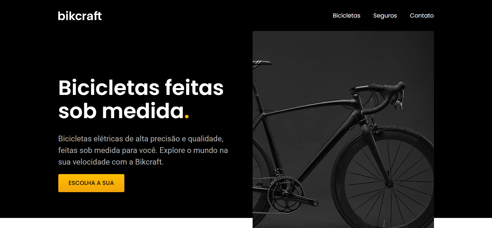

# Bikcraft ([Click Here](https://bikcraft-netinhoalves.vercel.app/))

## SOBRE ESTE PROJETO!

Bikcraft é um projeto desenvolvido como um desafio proposto pelo [André Rafael](https://www.youtube.com/origamid), no final do curso ["HTML e CSS para Iniciantes"](https://www.origamid.com/curso/html-e-css-para-iniciantes/). Durante o curso, aprendi muito sobre tecnologias web e pude aplicar esses conhecimentos em outros projetos.

## Objetivo
O objetivo do projeto é criar um website para uma empresa fictícia de fabricação e venda de bicicletas personalizadas e artesanais.

## Tecnologias usadas

* HTML5
* CSS3
* FlexBox
* CSS Grid Layout
* Media-queries
* Layout Responsivo

## Acessar minha resolução

   Eu hospedei este desafio com a ajuda da [Vercel](https://vercel.com/), para acessar minha resolução deste desafio [Clique Aqui](https://bikcraft-netinhoalves.vercel.app/)